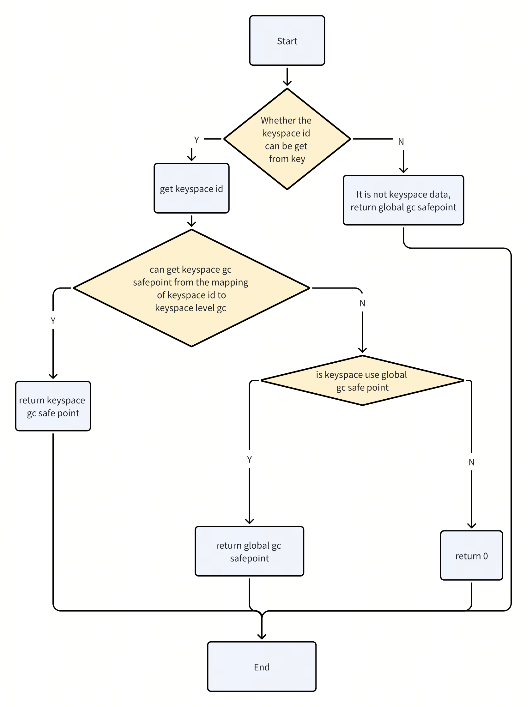

# Keyspace level GC

## Summary

- RFC PR:
- Tracking Issue: 

TiKV support keyspace level gc.

## Motivation

Previously, TiDB has supported the deployment of multiple TiDB clusters with different keyspaces on a single PD TiKV cluster.

We've implemented multiple TiDB clusters, with one global TiDB GC worker (A TiDB server without Keyspace configuration) to calculate the global GC SafePoint and resolve locks, While each keyspace's TiDB has their own GC Worker, keyspace GC Worker use the global GC SafePoint to do deleteRange in the sepical keyspace ranges.

But old implementation causes the calculation of the global gc to depend on the oldest safe point and min start ts of all keyspaces and TiDB cluster without keyspace configured.

So we propose the implementation of keyspace level gc:

TiDB PR https://github.com/pingcap/tidb/pull/51300 implements: Isolation of GC SafePoint computations between keyspaces (the concept in the code is keyspace level gc). When the Keyspace GC SafePoint advancement of Keyspace with keyspace level gc is slow, it can not affect the GC SafePoint advancement of other keyspaces and clean data in time. Each keyspace TiDB cluster can initially create the keyspace if the keyspace meta config is set: gc_management_type = keyspace_level_gc, that is, the GC SafePoint that can advance its own Keyspace in the Keyspace dimension.

TiKV PR https://github.com/tikv/tikv/pull/16808 implemented on TiKV side: When GC keyspace data, It parses the keyspace id from the key, combines the keyspace meta cache and the keyspace level GC safepoint cache corresponding to the keyspace id to determine whether to use this keyspace keyspace_level_gc safepoint to gc.

## Concepts of GC management type:
1. Global GC:
    - Represents the previous default GC logic; there is a TiDB calculate the global gc safepoint for the whole cluster.
    - The default GC management type for keyspace is Global GC,
2. Keyspace level GC:
    - Indicates that the keyspace will advance its own gc safe point.
    - It is possible and only possible to set gc_management_type = keyspace_level_gc when PD creates keyspaces
    - The keyspace which already set gc_management_type = keyspace_level_gc that uses Global GC is not supported
    - Keyspace GC-related data minstartts, gc safepoint,service safepoint have their own storage path with keyspace prefix in PD. Thus the GC of keysapce can be advanced by itself.

## Implementation in TiKV
1. Get keyspace meta and keyspace level gc safepoint:
    - New KeyspaceMetaWatchService : Watch keyspace meta etcd path to get the keyspace meta and put it in cache keyspace_id_meta_map: <u32, keyspacepb::KeyspaceMeta>
    - New KeyspaceLevelGCWatchService : Watch the etcd path of the keyspace gc safe point to get the GC safe point with keyspace level GC enabled, Put in cache keyspace_level_gc_map: <u32, u64>,

2. How to get GC safepoint by mvcc key in Compaction Filter:

3. How to determine if a keyspace uses a global gc safe point:

4. Use GC safe point to optimize trigger timing and assert judgment
   1. Skip GC when GC safe point is 0 in create_compaction_filter.
   2. check_need_gc function return false in create_compaction_filter.
   3. assert( safe_point > 0 ) when new compaction filter.

5. Other non-GC logic that uses GC safe point does not currently have to support keyspace level GC.
   1. check region consistency command: 
      1. It will check GC safe point on followers to ensure that the data to be checked on the follower is not GC. 
      2. If user request a keyspace range region with keyspace level gc enabled, the user will get a "not supported" message.
   2. GC safe point used in raftstore to trigger compaction when no valid split key can be found. It was introduced in PR https://github.com/tikv/tikv/pull/15284
      1. It just uses GC safe point to determine when to trigger compaction. The main PR of the Keyspace level gc will not fit this logic. It will be considered for submitting another PR for support after the keyspace level gc core PR is merged.